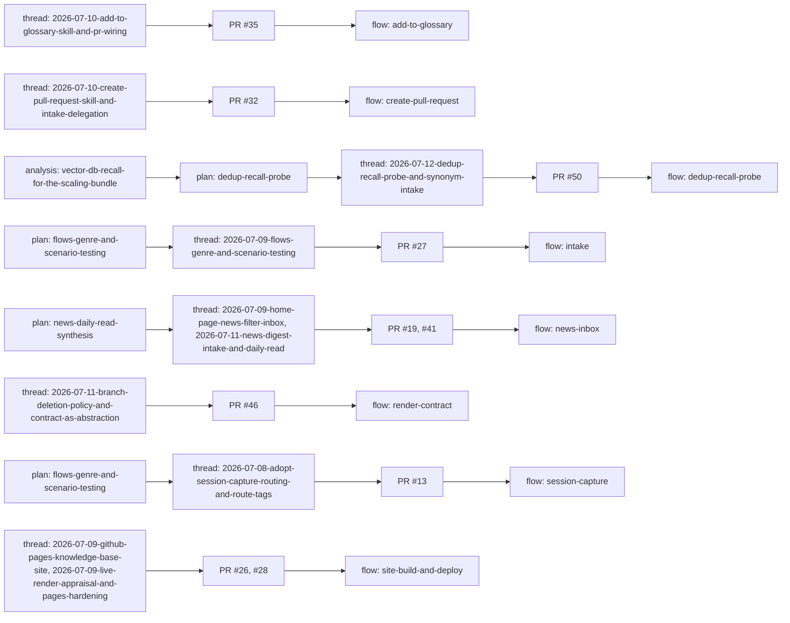

<!--
  GENERATED FILE — do not edit by hand.
  Source of truth: the `lineage:` frontmatter of each meta/flows/*.md doc.
  Regenerate:      mix brain.lineage
  Verify (CI):     mix brain.lineage --check
-->

# Flow lineage — how each flow came to be

Every flow doc records the arc that produced it — the originating `analysis`
(a problem identified against evidence), the `plan` that designed it, the
`thread` (the captured session that built it), and the merging PR. This page is
the cross-flow view, derived from every doc's `lineage:` frontmatter block. See
the [flows index](/meta/flows/index.md) for the flows themselves and the
[flow-lineage plan](/meta/plans/flow-lineage-index.md) for the design.

## Flowchart

## Table

| Flow | Analysis | Plan | Thread | PR |
|------|----------|------|--------|----|
| [Add to glossary — accrete per-term definition concepts](/meta/flows/add-to-glossary.md) | — | — | [2026-07-10-add-to-glossary-skill-and-pr-wiring](/meta/threads/2026-07-10-add-to-glossary-skill-and-pr-wiring.md) | PR #35 |
| [Create pull request — capture, glossary, commit, push, open](/meta/flows/create-pull-request.md) | — | — | [2026-07-10-create-pull-request-skill-and-intake-delegation](/meta/threads/2026-07-10-create-pull-request-skill-and-intake-delegation.md) | PR #32 |
| [Dedup recall probe — measuring and maintaining intake dedup recall](/meta/flows/dedup-recall-probe.md) | [Would a vector DB improve recall as this bundle scales? A dedup-recall probe says fix intake first](/meta/analysis/vector-db-recall-for-the-scaling-bundle.md) | [Dedup recall probe: a gold set of natural-phrasing queries and a mix task that measures intake dedup recall](/meta/plans/dedup-recall-probe.md) | [2026-07-12-dedup-recall-probe-and-synonym-intake](/meta/threads/2026-07-12-dedup-recall-probe-and-synonym-intake.md) | PR #50 |
| [Intake — capture pasted material into a filed concept](/meta/flows/intake.md) | — | [The flows genre + formal scenario testing](/meta/plans/flows-genre-and-scenario-testing.md) | [2026-07-09-flows-genre-and-scenario-testing](/meta/threads/2026-07-09-flows-genre-and-scenario-testing.md) | PR #27 |
| [News — generate the daily inbox of candidates](/meta/flows/news-inbox.md) | — | [The daily read: a cross-domain synthesis lede for /news digests](/meta/plans/news-daily-read-synthesis.md) | [Thread — home-page news-filter inbox (/news + inbox/ namespace)](/meta/threads/2026-07-09-home-page-news-filter-inbox.md) [2026-07-11-news-digest-intake-and-daily-read](/meta/threads/2026-07-11-news-digest-intake-and-daily-read.md) | PR #19 PR #41 |
| [Render-contract — compile the operating contract from its policy sources](/meta/flows/render-contract.md) | — | — | [2026-07-11-branch-deletion-policy-and-contract-as-abstraction](/meta/threads/2026-07-11-branch-deletion-policy-and-contract-as-abstraction.md) | PR #46 |
| [Session capture, routing & route tags — flow](/meta/flows/session-capture.md) | — | [The flows genre + formal scenario testing](/meta/plans/flows-genre-and-scenario-testing.md) | [Thread — adopt session capture, routing ledger, and route tags](/meta/threads/2026-07-08-adopt-session-capture-routing-and-route-tags.md) | PR #13 |
| [Site build & Pages deploy — render the bundle to the live site](/meta/flows/site-build-and-deploy.md) | — | — | [Thread — GitHub Pages knowledge-base site, offline-toolchain tutorial, and the OKF node](/meta/threads/2026-07-09-github-pages-knowledge-base-site.md) [2026-07-09-live-render-appraisal-and-pages-hardening](/meta/threads/2026-07-09-live-render-appraisal-and-pages-hardening.md) | PR #26 PR #28 |

